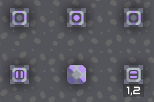
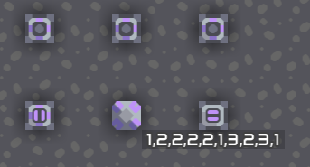

# 示例程序2

本示例主要展示数组语法的用法。

```
def check(btn, idx) {
    $ sensor on btn @enabled
    if (!on) {
        cell1[idx + 40] = 0
    } else if (cell1[idx + 40] == 0) {
        cell1[idx + 40] = 1
        cnt = cell1[40]
        cell1[cnt] = idx
        cell1[40] = cnt + 1
    }
}

_ = check(switch1, 1)
_ = check(switch2, 2)
_ = check(switch3, 3)

it = 0
cnt = cell1[40]
while (it < cnt) {
    val = cell1[it]
    it = it + 1
    $ print val
    if (it != cnt)
        $ print ","
}
$ printflush message1
```

这个程序接受三个开关作为输入，将输入的数字序列存在内存元中，并输出到信息板上。

初始状态:


点击第一个开关后:


再点击第二个开关后:



随意地点击开关（注：微型处理器运行速度较慢，点击速度过快可能不会被检测到）:


