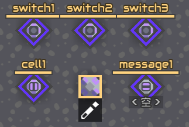
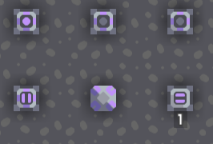
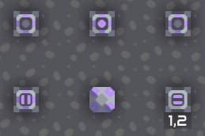
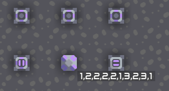

# Example 2

This example is dedicated to showing the usage of array syntax.

```
def check(btn, idx) {
    $ sensor on btn @enabled
    if (!on) {
        cell1[idx + 40] = 0
    } else if (cell1[idx + 40] == 0) {
        cell1[idx + 40] = 1
        cnt = cell1[40]
        cell1[cnt] = idx
        cell1[40] = cnt + 1
    }
}

_ = check(switch1, 1)
_ = check(switch2, 2)
_ = check(switch3, 3)

it = 0
cnt = cell1[40]
while (it < cnt) {
    val = cell1[it]
    it = it + 1
    $ print val
    if (it != cnt)
        $ print ","
}
$ printflush message1
```

This program accepts 3 switches as input, store the input sequence in a memory cell, and print them onto a message board.

Initially:



After clicking the first switch:



After clicking the second switch:



Click the switches randomly (Note: micro processors run pretty slow, input may not be detected if turned off too soon):


